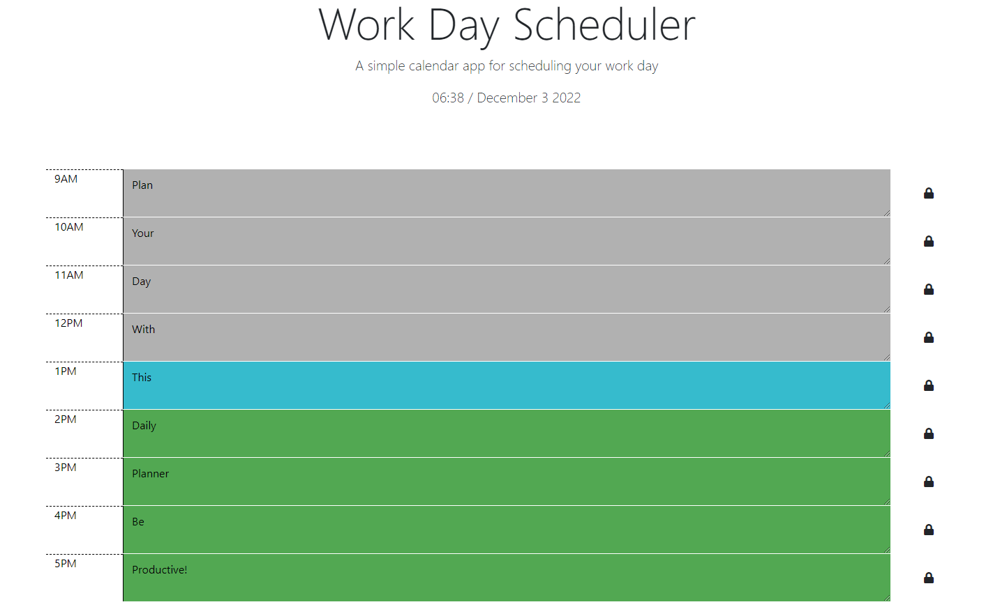

## Daily Planner!

# Introduction 
This is a daily planner that you can use to plan your day!
Built with Dayjs and Jquery!

# Usage
* Write your planned ToDo in the hour slot and click the button to save!
* To change ToDo click button again then replace text and re-click!
* Added bonus of colour code that shows blue for current time, grey for past and red for future time!

# Screenshot 

# Link
A link to the deployed application 

https://alastairhafield.github.io/DailyPlanner-AlastairHatfield/

